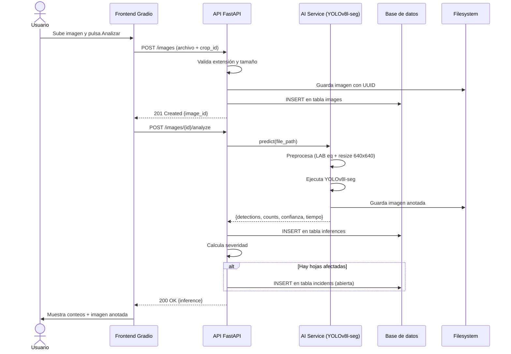

# Diagrama de secuencia: análisis de una imagen

Caso de uso principal: usuario autenticado sube una foto de hoja y obtiene un diagnóstico visual.

```mermaid
sequenceDiagram
    actor U as Usuario
    participant F as Frontend Gradio
    participant A as API FastAPI
    participant S as AI Service (YOLOv8l-seg)
    participant D as Base de datos
    participant FS as Filesystem

    U->>F: Sube imagen y pulsa Analizar
    F->>A: POST /images (archivo + crop_id)
    A->>A: Valida extensión y tamaño
    A->>FS: Guarda imagen con UUID
    A->>D: INSERT en tabla images
    A-->>F: 201 Created {image_id}

    F->>A: POST /images/{id}/analyze
    A->>S: predict(file_path)
    S->>S: Preprocesa (LAB eq + resize 640x640)
    S->>S: Ejecuta YOLOv8l-seg
    S->>FS: Guarda imagen anotada
    S-->>A: {detections, counts, confianza, tiempo}
    A->>D: INSERT en tabla inferences
    A->>A: Calcula severidad
    alt Hay hojas afectadas
        A->>D: INSERT en tabla incidents (abierta)
    end
    A-->>F: 200 OK {inference}
    F->>U: Muestra conteos + imagen anotada
```
